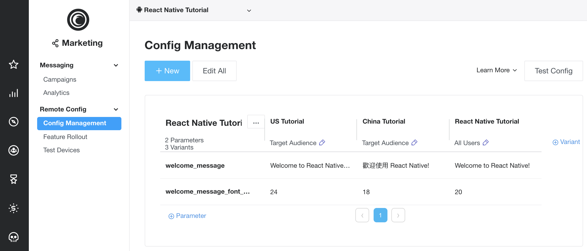
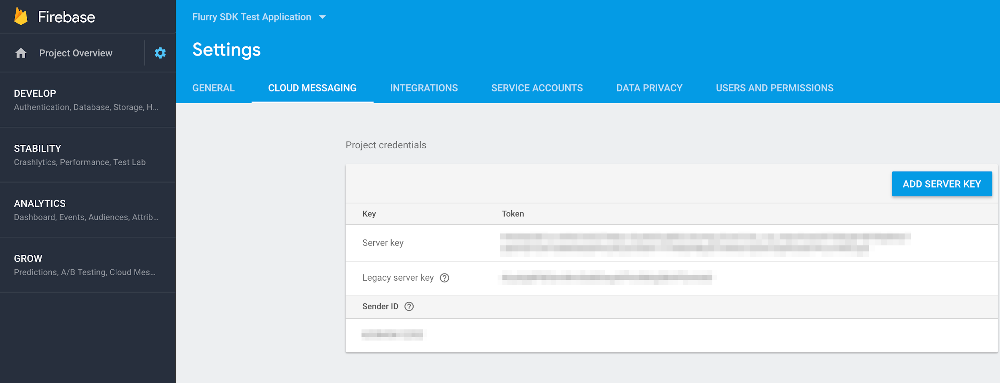
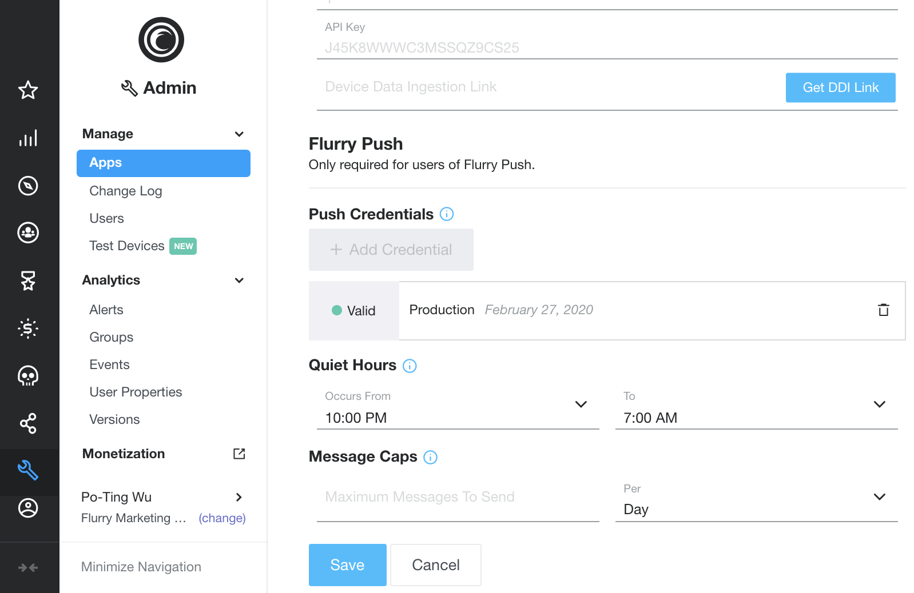
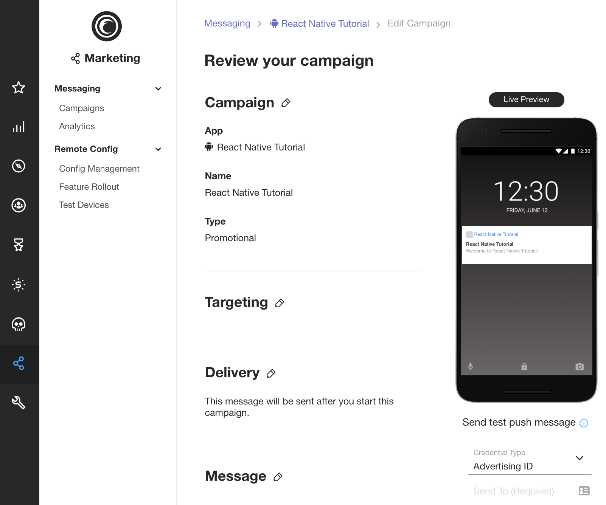
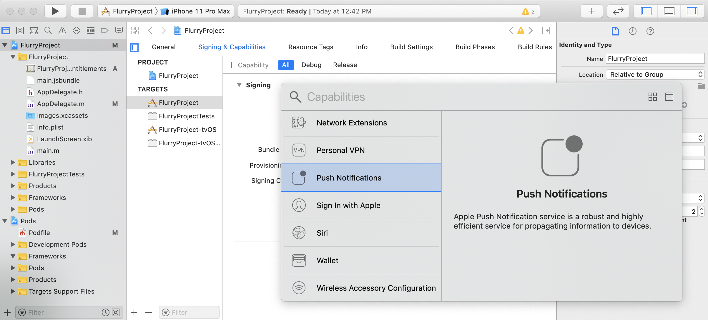
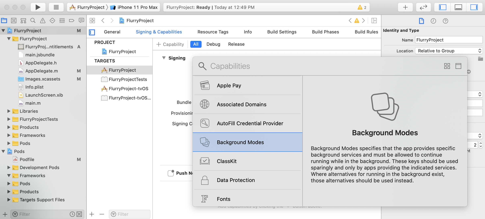
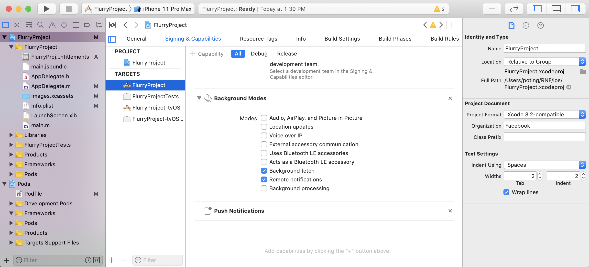

# React Native Flurry SDK Tutorial

- [Install React Native](#install-react-native)
- [Create React Native Flurry Project](#create-react-native-flurry-project)
  - [Run React Native Flurry Project](#run-react-native-flurry-project)
- [Integrate Flurry Config in React Native Project](#integrate-flurry-config-in-react-native-project)
- [Integrate Flurry Push in React Native Project](#integrate-flurry-push-in-react-native-project)
  - [Android Flurry Push](#android-flurry-push)
  - [iOS Flurry Push](#ios-flurry-push)
- [Support](#support)
- [License](#license)

This tutorial is based on the fact that you already have basic mobile development skills and environment setup. If you already have React Native installed, you can skip to the [Create React Native Flurry Project](#create-react-native-flurry-project) section.

* Download the tutorial from  [https://git.ouroath.com/poting/React-Native-Tutorial](https://git.ouroath.com/poting/React-Native-Tutorial). Before start running the tutorial sample app, please apply the following command to install required npm dependencies.

    ```bash
    $ npm install
    
    # iOS only; to install CocoaPods dependency
    $ cd ios && pod install && cd ..
    ```

# Install React Native

Getting Started

[https://facebook.github.io/react-native/docs/getting-started.html#caveats](https://facebook.github.io/react-native/docs/getting-started.html#caveats)

This tutorial will use "React Native CLI" for development. Please follow the links of,<br>
React Native CLI Quickstart -> macOS -> iOS/Android.

1. Install Node

    ```bash
    $ brew install node
    $ brew install watchman
    ```

2. Initialize npm and install React Native Command Line

    ```bash
    $ npm init
    $ npm install react-native
    $ npm install -g react-native-cli
    ```

# Create React Native Flurry Project

1. Create a React Native project with Flurry plugin

    ```bash
    $ react-native init FlurryProject
    $ cd FlurryProject
    $ npm install react-native-flurry-sdk --save
    ```

    * If you are using React Native >= 0.60, install CocoaPods dependency

      ```bash
      $ cd ios && pod install && cd ..
      ```

    * If you are using React Native < 0.60, link React Native dependency

      ```bash
      $ react-native link react-native-flurry-sdk
      ```

      **Android**: Optionally you can improve analytics identities by adding Google Play Services library in your app.

      ```groovy
      // android/app/build.gradle
      dependencies {
          Implementation 'com.google.android.gms:play-services-base:15.0.1'
          implementation 'com.google.android.gms:play-services-ads:15.0.1'
      }
      ```

2. Add Flurry JavaScript codes in `index.js` to initialize Flurry

    ```javascript
    import Flurry from 'react-native-flurry-sdk';
    
    // Init Flurry once as early as possible recommended in index.js.
    new Flurry.Builder()
        .withLogEnabled(true)
        .withLogLevel(Flurry.LogLevel.DEBUG)
        .build(FLURRY_ANDROID_API_KEY, FLURRY_IOS_API_KEY);
    ```

3. Add Flurry JavaScript codes in `App.js` to log Flurry events

    ```javascript
    import Flurry from 'react-native-flurry-sdk';
 
    // Log Flurry events.
    Flurry.logEvent('React Native Event');
    ```

## Run React Native Flurry Project

   ```bash
   $ react-native run-android
   $ react-native run-ios
   ```

# Integrate Flurry Config in React Native Project

[Flurry Remote Config](https://developer.yahoo.com/flurry/docs/config/) is the free service from Flurry that helps developers update app experience for users without requiring users to update to a new version of your app -  [Android](https://developer.yahoo.com/flurry/docs/config/integration/android/) and [iOS](https://developer.yahoo.com/flurry/docs/config/integration/ios/).

To learn more, please checkout our Remote Config sample apps (Flurry SDK) as a reference implementation - [Android](https://github.com/flurry/android-ConfigSample) and [iOS](https://github.com/flurry/ios-ConfigSample).

In order to use Flurry Config in React Native projects, please follow the additional steps below.

1. Set up and add your Flurry remote Config key-value pairs in the Flurry console.<br>
Click Marketing tab -> select Config Management under Remote Config.<br>
[https://dev.flurry.com/marketing/config/remote-config](https://dev.flurry.com/marketing/config/remote-config)

   

2. Add Flurry JavaScript codes to use the remote configuration values.

    ```javascript
    Flurry.addConfigListener((event) => {
      if (event.Type === Flurry.ConfigStatus.SUCCESS) {
        // Data fetched, activate it.
        Flurry.activateConfig();
      } else if (event.Type === Flurry.ConfigStatus.ACTIVATED) {
        // Received cached data, or newly activated data.
        Flurry.getConfigString('welcome_message', 'Welcome!').then((value) => {
          console.log((event.isCache ?
              'Received cached data: ' : 'Received newly activated data: ') +
              value.welcome_message);
        });
      } else if (event.Type === Flurry.ConfigStatus.UNCHANGED) {
        // Fetch finished, but data unchanged.
        Flurry.getConfigString('welcome_message', 'Welcome!').then((value) => {
          console.log('Received unchanged data: ' + value.welcome_message);
        });
      } else if (event.Type === Flurry.ConfigStatus.ERROR) {
        // Fetch failed.
        console.log('Fetch error! Retrying: ' + event.isRetrying);
      }
    });
    
    Flurry.fetchConfig();
    ```

# Integrate Flurry Push in React Native Project

[Flurry Push](https://developer.yahoo.com/flurry/docs/push/) enables app developers to send targeted messages to re-engage and retain users.

In order to use Flurry Push in React Native projects for [Android](https://developer.yahoo.com/flurry/docs/push/integration/android/) or [iOS](https://developer.yahoo.com/flurry/docs/push/integration/ios/), please follow the additional steps below.

## Android Flurry Push

1. Android Flurry Push requires your projects to initialize Flurry from the native Application class, you can find the Java file in,

    ```bash
    $PROJ_ROOT/android/app/src/main/java/com/$proj_name/MainApplication.java
    ```
 
   Please do the Flurry setup in `MainApplication.onCreate()`. With the same APIs as the JavaScript version.

    ```java
    import com.flurry.android.reactnative.FlurryModule;
    
    new FlurryModule.Builder()
        .withLogEnabled(true)
        .withMessaging(true, options_or_listener)    // optional user's native options or listener
        .build(this, FLURRY_ANDROID_API_KEY);
    ```

   * Optionally you can add a Flurry Messaging listener to monitor the messaging *receive*, *click*, and *cancel* actions.

     ```javascript
     Flurry.addMessagingListener((message) => {
       if (message.Type === Flurry.MessageType.RECEIVED) {
         Flurry.willHandleMessage(false);
         // Add your actions here.
       } else if (message.Type === Flurry.MessageType.CLICKED) {
         Flurry.willHandleMessage(false);
         // Add your actions here.
       }
       Flurry.printMessage(message);
     });
     ```

2. Follow [Set up a Firebase Cloud Messaging client app on Android](https://firebase.google.com/docs/cloud-messaging/android/client). Complete "Set up Firebase and the FCM SDK" step for adding Firebase to your Android project.

    1. [Add Firebase to your Android project](https://firebase.google.com/docs/android/setup)

        1. Create a Firebase project: In the [Firebase console](https://console.firebase.google.com/), click Add project, then select or enter a Project name.
        2. Register your app with Firebase: In the center of the project overview page, click the Android icon to launch the setup. (e.g., package name: `com.flurryproject`)
        3. Add the Firebase configuration file: Download `google-services.json`, move the file to your project. (e.g., `$PROJ_ROOT/android/app`)

    2. Enable Firebase products: Add rules in the project-level and app-level Gradle files. Your `build.gradle` will look like:

       ```groovy
       // android/build.gradle (project-level)
       buildscript {
           dependencies {
               classpath 'com.google.gms:google-services:4.3.3'
           }
       }
       ```

       ```groovy
       // android/app/build.gradle (app-level)
       apply plugin: 'com.google.gms.google-services'
       
       dependencies {
           implementation 'com.google.firebase:firebase-messaging:20.1.0'
       }
       ```

    3. Get your Firebase Cloud Messaging Server key: On the left panel of the Firebase console, click the Project Settings button on the right side of Project Overview. Under the Cloud Messaging tab, copy your Server key.

       

3. Set up "Android Authorization" in [Flurry Push Authorization](https://developer.yahoo.com/flurry/docs/push/authorization/#android-authorization). After copying your Firebase Cloud Messaging Server key as described in the previous section,

    1. Go to Flurry Admin -> Apps, select Edit for the app corresponded
    2. Click "+ Add Credential", paste the Server Key in the field provided
    3. Click Save

       

4. Test Flurry Push by [sending test pushes](https://developer.yahoo.com/flurry/docs/push/testpush/send/). To send a test push, visit the Marketing tab. Select the app you want to test and then click the "+ Create Push Campaign" button. Follow the steps to set up the campaign until you get to the final step labeled “Review your campaign.”

   

## iOS Flurry Push

1. Open your `Podfile`, which is located under the `ios` folder of your project. Add the following line in the target section before `use native modules!`.

    ```ruby
    `pod 'react-native-flurry-sdk', :path => '../node_modules/react-native-flurry-sdk/ios', :subspecs => ['FlurrySDK-Push']`
    ```

   The target section of `Podfile` should now look like this:

    ```ruby
    target 'FlurryProject' do
      …
      pod 'react-native-flurry-sdk', :path => '../node_modules/react-native-flurry-sdk/ios', :subspecs => ['FlurrySDK-Push']
    
      target 'FlurryProjectTests' do
        inherit! :search_paths
        # Pods for testing
      end
    
      use_native_modules!
    End
    ```

2. Install the dependencies again by executing

    ```bash
    $ cd ios && pod install && cd ..
    ```

3. Open your `.xcworkspace` file which is under the `ios` folder.

    ```bash
    $ open FlurryProject.xcworkspace
    ```

    1. Go to the "Signing & Capabilities" tab and add Capability “Push Notifications”.

       

    2. Add Capability “Background Modes”, and enable “Background Fetch” and “Remote Notifications”.

       

       

   For more information, please see [Push Setup](https://developer.yahoo.com/flurry/docs/push/integration/ios/).

4. Set up "iOS Authorization" in [Flurry Push Authorization](https://developer.yahoo.com/flurry/docs/push/authorization/).

5. In order to handle notifications from a cold start, Flurry Push requires to be initialized from AppDelegate as early as possible. Please open `AppDelegate.m` (under `ios/$proj_name` folder), import the header file

    ```objc
    #import "ReactNativeFlurry.h"
    ```

   And add this line right after `- (BOOL)application:(UIApplication *)application didFinishLaunchingWithOptions:(NSDictionary *)launchOptions`

    ```objc
    [ReactNativeFlurry enableMessaging];
    ```
   The `AppDelegate.m` should now look like this:

    ```objc
    #import "ReactNativeFlurry.h"
    
    @implementation AppDelegate
    
    - (BOOL)application:(UIApplication *)application didFinishLaunchingWithOptions:(NSDictionary *)launchOptions
    {
      [ReactNativeFlurry enableMessaging];
    ```

# Support

- [Flurry Developer Support Site](https://developer.yahoo.com/flurry/docs/)

# License

Copyright 2018 Oath Inc.

Licensed under the Apache License, Version 2.0 (the "License");
you may not use this file except in compliance with the License.
You may obtain a copy of the License at

  http://www.apache.org/licenses/LICENSE-2.0

Unless required by applicable law or agreed to in writing, software
distributed under the License is distributed on an "AS IS" BASIS,
WITHOUT WARRANTIES OR CONDITIONS OF ANY KIND, either express or implied.
See the License for the specific language governing permissions and
limitations under the License.
